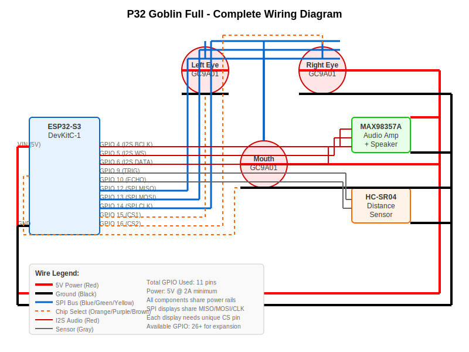

# 🤖 P32 Goblin Full - Complete Visual Build Guide

## 📋 What You're Building

A mood-driven animatronic goblin head with:
- **3 Animated Displays** (2 eyes + 1 mouth)
- **Distance Sensing** (proximity detection)
- **Audio Output** (sounds and speech)
- **9 Emotional States** (automatic mood changes)

---

## 🔌 Complete Wiring Diagram



### 📍 GPIO Pin Assignments Quick Reference

| GPIO | Component | Function | Wire Color |
|------|-----------|----------|------------|
| 4 | Audio Amp | I2S BCLK | Red |
| 5 | Audio Amp | I2S WS | Black |
| 6 | Audio Amp | I2S DATA | White |
| 9 | HC-SR04 | TRIG | Gray |
| 10 | HC-SR04 | ECHO | Pink |
| 12 | All Displays | SPI MISO | Blue |
| 13 | All Displays | SPI MOSI | Green |
| 14 | All Displays | SPI CLK | Yellow |
| 15 | Left Eye | CS | Orange |
| 16 | Right Eye | CS | Purple |
| 17 | Mouth | CS | Brown |

---

## ⚡ Power Distribution System

```
Power Rail Architecture:

5V Supply ─┬─ ESP32 VIN
           ├─ All Display VCC pins
           ├─ Audio Amp VCC
           └─ Sensor VCC

Ground ────┬─ ESP32 GND
           ├─ All Display GND pins  
           ├─ Audio Amp GND
           └─ Sensor GND
```

**Critical:** All components share common 5V and Ground rails

---

## 🔧 Assembly Order (Follow This Sequence!)

### 1️⃣ **Power Setup First**
```
Breadboard Setup:
┌─────────────────────────────────────┐
│ Red Rail    [+5V from supply] ●●●●● │
│                                     │
│ Main Area   [Components here]       │
│                                     │
│ Black Rail  [GND from supply] ●●●●● │
└─────────────────────────────────────┘
```

### 2️⃣ **ESP32 Connection**
- VIN → Red power rail
- GND → Black power rail
- **Test:** Verify 5V with multimeter before proceeding

### 3️⃣ **SPI Bus Wiring (Shared Lines)**
```
ESP32 Shared SPI Bus:
    GPIO 12 (MISO) ───┬──┬──┬── All displays SDO
    GPIO 13 (MOSI) ───┼──┼──┼── All displays SDA
    GPIO 14 (CLK)  ───┼──┼──┼── All displays SCL
                      │  │  │
                   Left│ Right│ Mouth
                    Eye│  Eye │ Display
```

### 4️⃣ **Individual Chip Selects**
- GPIO 15 → Left eye CS (Orange wire)
- GPIO 16 → Right eye CS (Purple wire)  
- GPIO 17 → Mouth CS (Brown wire)

### 5️⃣ **Audio System**
```
I2S Digital Audio:
    ESP32 GPIO 4 ──── MAX98357A BCLK
    ESP32 GPIO 5 ──── MAX98357A LRCK  
    ESP32 GPIO 6 ──── MAX98357A DIN
    
    MAX98357A + ──── Speaker +
    MAX98357A - ──── Speaker -
```

### 6️⃣ **Distance Sensor**
```
HC-SR04 Connections:
    ESP32 GPIO 9  ──── TRIG pin
    ESP32 GPIO 10 ──── ECHO pin
    5V power rail ──── VCC pin
    Ground rail   ──── GND pin
```

---

## 🧪 Testing Checklist

### Power Verification (Use Multimeter)
- [ ] 5V present on ESP32 VIN
- [ ] 5V present on all display VCC pins
- [ ] 5V present on audio amp VCC
- [ ] 5V present on sensor VCC
- [ ] Continuity on all GND connections

### Software Upload
- [ ] PlatformIO project opens without errors
- [ ] `ENABLE_GOBLIN_COMPONENTS` defined in config
- [ ] Build completes (~5.8% RAM, ~51.7% Flash)
- [ ] Upload successful to COM port
- [ ] Serial monitor shows loop messages

### Component Function Tests
- [ ] All 3 displays show content
- [ ] Eye displays animate (blink cycle)
- [ ] Mouth display changes colors
- [ ] Speaker produces clear audio
- [ ] Distance sensor readings change with proximity
- [ ] Mood system cycles through emotions

---

## 🎭 Mood System Overview

Your goblin automatically cycles through 9 emotions:

| Emotion | Visual Effect | Trigger Condition |
|---------|---------------|-------------------|
| 😨 **FEAR** | Pale colors, rapid blinks | Sudden proximity |
| 😠 **ANGER** | Red colors, intense stare | Sustained proximity |
| 😤 **IRRITATION** | Orange tints, narrow eyes | Repeated interaction |
| 😊 **HAPPINESS** | Bright colors, wide eyes | Positive interaction |
| 😌 **CONTENTMENT** | Soft blue, relaxed | Extended calm period |
| 🍽️ **HUNGER** | Green tints, searching | Time-based cycle |
| 🤔 **CURIOSITY** | Blue tints, alert look | Motion detection |
| 💖 **AFFECTION** | Pink tints, gentle gaze | Gentle interaction |
| 🤩 **EXCITEMENT** | Rapid color changes | High activity |

---

## 🚨 Troubleshooting Guide

### No Display Output
**Symptoms:** Black screens on all displays
**Check:**
- 5V power on display VCC pins
- SPI wiring (GPIO 12,13,14 connections)
- Individual CS pin connections (GPIO 15,16,17)

### Build/Upload Errors
**Symptoms:** Compilation fails
**Check:**
- `p32_component_config.h` contains `#define ENABLE_GOBLIN_COMPONENTS`
- USB-C cable connected to ESP32
- Correct COM port detected

### No Audio
**Symptoms:** Silent speaker
**Check:**
- I2S connections (GPIO 4,5,6)
- 5V power to audio amplifier
- Speaker polarity (+ and - terminals)

### Sensor Not Working
**Symptoms:** Fixed distance readings
**Check:**
- HC-SR04 requires full 5V (not 3.3V)
- GPIO 9,10 connections
- No obstructions in front of sensor

---

## 🔧 Component Specifications

### ESP32-S3-DevKitC-1
- **MCU:** Dual-core 240MHz
- **RAM:** 512KB SRAM
- **Flash:** 8MB
- **WiFi/Bluetooth:** Built-in
- **GPIO:** 45 pins (11 used, 34+ available)

### GC9A01 Round Displays (×3)
- **Size:** 1.28" diameter
- **Resolution:** 240×240 pixels
- **Interface:** SPI (7-pin)
- **Colors:** 65,536 (RGB565)
- **Voltage:** 3.3V logic, 5V power

### MAX98357A Audio Amplifier
- **Interface:** I2S digital input
- **Output:** 3W @ 4Ω
- **SNR:** 92dB
- **Voltage:** 5V power

### HC-SR04 Distance Sensor
- **Range:** 2cm to 400cm
- **Accuracy:** ±3mm
- **Interface:** Digital trigger/echo
- **Voltage:** 5V required

---

## 🚀 Expansion Ideas

With 34+ unused GPIO pins, add:
- **Servo neck movement** (PWM control)
- **LED accent lighting** (WS2812B strips)
- **Camera module** (ESP32-CAM integration)
- **Microphone input** (I2S or ADC)
- **Wheeled mobility base** (motor controllers)
- **Additional displays** (expand face features)

---

## 📞 Support Resources

- **GitHub Repository:** [p32-animatronic-bot](https://github.com/reussered/p32-animatronic-bot)
- **Documentation:** See `/docs` folder for technical specs
- **Hardware Datasheets:** Component manufacturer websites
- **ESP32 Resources:** Espressif official documentation

---

**🎉 Congratulations! You've built a complete mood-driven animatronic system!**

*Print this guide in color for best results. The SVG diagram will scale perfectly on any printer.*