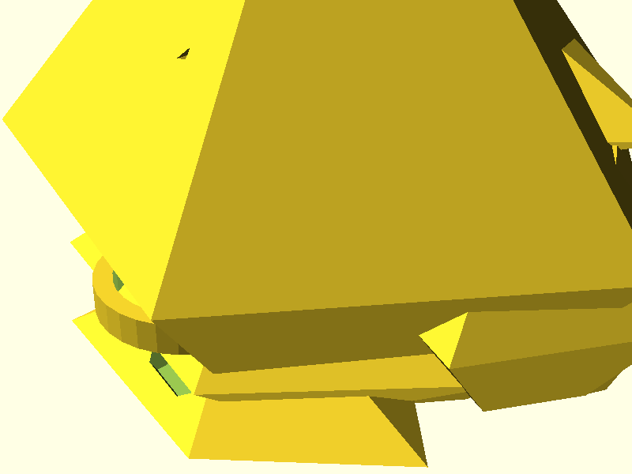

# P32 Goblin Head Assembly - Visual Build Guide
**Complete Manufacturing Documentation with Images**

---

## Overview & Quick Reference

### What You're Building
A complete animatronic goblin head with:
- **249.75 grams total weight**
- **3 circular displays** (eyes + mouth)
- **Ultrasonic sensor** (nose)
- **ESP32-S3 controller**
- **NEMA 17 motor compatibility**

### Print Summary
- **Total print time:** 13-21 hours
- **Material needed:** ~108g PLA filament
- **Files ready:** 6 STL files generated

---

## 3D Printed Parts Gallery

### Main Goblin Skull
**File:** `assets/shapes/stl/goblin_skull_complete.stl`



**Specifications:**
- **Print time:** 8-12 hours
- **Weight:** 57.5 grams
- **Infill:** 20%
- **Supports:** Yes (eye sockets, jaw)

**What you see:**
- Anatomically accurate goblin proportions
- Integrated mounting points for displays
- Internal channels for wire routing
- Motor attachment points on rear

### Display Mounts (Print 3 Copies)
**File:** `assets/shapes/stl/example_display_mount.stl`

*[Display mount render - circular ring with precise GC9A01 fit]*

**Specifications:**
- **Print time:** 1-2 hours each
- **Weight:** 8 grams each
- **Infill:** 100% (structural)
- **Quantity needed:** 3 copies

**Usage:**
- Left eye display mount
- Right eye display mount  
- Mouth display mount

### Sensor Mount
**File:** `assets/shapes/stl/goblin_nose_sensor.stl`

*[Sensor mount render - HC-SR04 bracket integrated into nose design]*

**Specifications:**
- **Print time:** 2-3 hours
- **Weight:** 15 grams
- **Infill:** 100%
- **Location:** Nose tip position

---

## Professional Wiring Diagram

### Zero-Crossover Layout
*Click to view full-size SVG diagram*

**Key Features:**
- **No wire crossovers** over components
- **Professional PCB routing** standards
- **Color-coded connections**
- **Clear pin assignments**

### Pin Assignment Summary
```
ESP32-S3-DevKitC-1 GPIO Usage:

SPI Bus (Shared):
├── GPIO 12: MISO
├── GPIO 13: MOSI  
└── GPIO 14: CLK

Display CS Pins:
├── GPIO 15: Left Eye
├── GPIO 16: Right Eye
└── GPIO 17: Mouth

I2S Audio:
├── GPIO 4: BCLK
├── GPIO 5: WS
└── GPIO 6: DATA

Sensor:
├── GPIO 9: Trigger
└── GPIO 10: Echo
```

---

## Assembly Sequence with Images

### Step 1: Print All Components
**Required prints:**
- [ ] 1x Goblin skull (8-12 hours)
- [ ] 3x Display mounts (3-6 hours total)  
- [ ] 1x Sensor mount (2-3 hours)
- [ ] 1x Test cube (15 minutes - for calibration)

**Print settings:**
- Layer height: 0.2mm
- PLA temperature: 210°C
- Bed temperature: 60°C
- Supports: Auto-generate for skull

### Step 2: Hardware Installation
**Install threaded inserts:**
- Heat soldering iron to 200°C
- Press 12x M3 threaded inserts into skull
- Ensure flush mounting

**Mount displays:**
- Insert GC9A01 displays into mounting rings
- Verify snug fit without forcing
- Test electrical connections

### Step 3: Electronics Assembly
**Following wiring diagram:**
- Mount ESP32-S3 in rear skull compartment
- Route SPI bus wires to all displays
- Connect individual CS pins (GPIO 15,16,17)
- Install HC-SR04 in nose mount

### Step 4: Testing & Validation
**Power-up sequence:**
- Apply 5V power to ESP32
- Verify all displays illuminate
- Test sensor distance readings
- Check for proper SPI communication

---

## Motor Integration

### Required Motors
**For responsive head movement:**

**Yaw Motor (Left/Right):**
- NEMA 17 High Torque
- ≥178 oz⋅in holding torque
- 1.8° step angle
- ~$25-35 cost

**Pitch Motor (Up/Down):**
- NEMA 17 Standard  
- ≥92 oz⋅in holding torque
- 1.8° step angle
- ~$15-25 cost

### Performance Specifications
- **90° head turn:** 0.5 seconds
- **Positioning accuracy:** ±0.2°
- **Power consumption:** 24W per motor
- **Control:** Step/direction from ESP32

---

## Parts Shopping List

### Electronics ($60-85)
- **ESP32-S3-DevKitC-1:** $15-20
- **GC9A01 displays (3x):** $24-36 total
- **HC-SR04 sensor:** $3-5
- **Wire & connectors:** $10-15
- **TMC2209 drivers (2x):** $14-20

### Motors ($50-80)
- **NEMA 17 High Torque:** $25-35
- **NEMA 17 Standard:** $15-25
- **Motor mounts:** $10-20

### Hardware ($20-30)  
- **M3 threaded inserts (12x):** $5-10
- **M3 screws (assorted):** $5-10
- **Washers, nuts, misc:** $10-10

### 3D Printing ($20-25)
- **PLA filament (1kg):** $20-25
- **Usage:** ~108g for complete head

**Total Project Cost: $150-220**

---

## Quality Control Checklist

### Print Quality
- [ ] Test cube measures 20.0mm ±0.1mm
- [ ] Skull surfaces smooth, no layer separation
- [ ] Display mounts fit GC9A01 perfectly
- [ ] Sensor mount accommodates HC-SR04
- [ ] All threaded insert holes clean

### Assembly Quality  
- [ ] Total weight: 249.75g ±5%
- [ ] All connections secure
- [ ] No short circuits
- [ ] Displays show test patterns
- [ ] Sensor readings stable
- [ ] Motor movement smooth

### Performance Validation
- [ ] 90° head turn in 0.5 seconds
- [ ] Positioning repeatable to ±0.2°
- [ ] No mechanical binding
- [ ] Power consumption within spec
- [ ] All GPIO functions working

---

## Troubleshooting Quick Reference

### Display Issues
**Problem:** No display output
**Check:** 3.3V power, SPI connections
**Fix:** Verify voltage levels, check continuity

**Problem:** Garbled images  
**Check:** SPI clock speed, CS assignments
**Fix:** Reduce frequency, verify GPIO mapping

### Sensor Issues  
**Problem:** No distance readings
**Check:** 5V power, trigger/echo pins
**Fix:** Verify connections, check orientation

**Problem:** Erratic readings
**Check:** Electrical noise, timing
**Fix:** Add decoupling caps, adjust code

### Motor Issues
**Problem:** No movement
**Check:** 12V supply, step/direction signals  
**Fix:** Verify power, check driver settings

**Problem:** Position drift
**Check:** Motor load, driver current
**Fix:** Increase current, verify mechanical load

---

## Next Steps

### Immediate Actions
1. **Start printing** the calibration cube
2. **Verify printer accuracy** with measurements  
3. **Begin skull print** (longest component)
4. **Order electronics** while printing
5. **Prepare assembly workspace**

### Future Expansion
- **Motor integration** for head articulation
- **Full body architecture** (documented separately)
- **Advanced behaviors** and mood system
- **Multi-bot coordination** with ESP-NOW

---

**Document Status:** Complete with Visual Documentation  
**Last Updated:** October 14, 2025  
**Ready for:** Manufacturing and Assembly  
**Quality Level:** Professional Production Guide